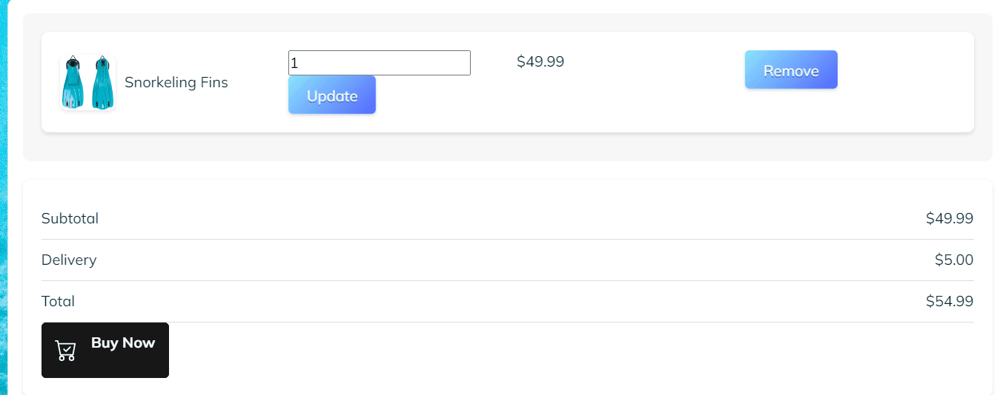
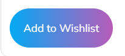

# Dive Goblin E-Commerce Project

## Table of Contents
1. [Project Overview](#project-overview)
2. [Features](#features)
3. [Custom Models](#custom-models)
4. [Forms and UI Elements](#forms-and-ui-elements)
5. [Agile Methodologies](#agile-methodologies)
6. [SEO and Marketing](#seo-and-marketing)
7. [Digital Marketing](#digital-marketing)
8. [E-Commerce Business Model](#e-commerce-business-model)
9. [Technical Setup](#technical-setup)
10. [Testing](#testing)
11. [Development and Deployment](#development-and-deployment)

## Project Overview
Dive Goblin is an e-commerce platform specializing in dive gear, watersports apparel, and travel-related products. Our goal is to provide enthusiasts with high-quality products and exceptional user experience.

Access to the site here: [Dive Goblin](https://dive-goblin-30c473dd6e64.herokuapp.com/)

## Features
- User registration, login, and logout functionality
- E-commerce functionality to browse, search, and purchase products
- Custom admin and user interfaces for managing products and orders
- Newsletter signup form for marketing purposes
- Custom 404 error page
- SEO optimized with robots.txt, sitemap.xml, and meta tags

# Front end Features to be implemented

## Home Page
- **Welcome Message**: A brief introduction to the website and its purpose.
- **Featured Products**: Display of top products or new arrivals to attract customer attention.
- **Navigation**: Easy access to different sections such as Shop, About, and Contact.

## Product Listings
- **Categories**: Products are organized into categories for easy browsing.
- **Product Cards**: Each product is displayed in a card with an image, name, price, and a short description.
- **Pagination**: Users can navigate through multiple pages of products.

## Product Detail Page
- **Product Images**: High-quality images of the product.
- **Product Information**: Detailed description, price, available sizes, and colors.
- **Add to Bag**: Option to select quantity and add the product to the shopping bag.
- **Related Products**: Suggestions for similar or complementary products.

## Shopping Bag
- **View Bag**: Overview of items added to the shopping bag with their details (name, quantity, price).
- **Update Quantities**: Ability to update the quantity of each item directly in the shopping bag.
- **Remove Items**: Option to remove items from the bag. 
- **Order Summary**: Subtotal, delivery charges, and total amount calculated and displayed.
- **Checkout Button**: Easy navigation to the checkout page.

## Checkout
- **Order Summary**: Recap of items in the bag with the total amount.
- **Delivery Details**: Form to enter shipping address and contact information.
- **Payment**: Secure payment gateway integration for processing payments.
- **Order Confirmation**: Confirmation message and order summary displayed after successful payment.

## User Accounts
- **Registration**: Users can create a new account by providing their details.
- **Login**: Existing users can log in using their email and password.
- **Profile Management**: Users can view and edit their profile information, including saved addresses and order history.

## Responsive Design
- **Mobile Friendly**: The website is fully responsive, providing a seamless experience on both desktop and mobile devices.
- **Navigation**: Mobile navigation menu for easy access to different sections.

## Search Functionality
- **Search Bar**: Users can search for products using keywords.
- **Search Results**: Display of products that match the search criteria with sorting options.

## Notifications
- **Success Messages**: Confirmation messages for actions such as adding items to the bag, updating quantities, and placing orders.
- **Error Messages**: User-friendly error messages for issues like invalid login credentials or out-of-stock items.

## Contact Form
- **Get in Touch**: Form for users to send messages or inquiries.
- **Validation**: Input validation to ensure the form is filled out correctly before submission.

## Footer
- **Quick Links**: Links to important pages such as Terms of Service, Privacy Policy, and FAQs.
- **Social Media**: Icons linking to the brand's social media profiles.
- **Contact Information**: Email and phone number for customer support.

## Enhancements
- **Animations**: Smooth transitions and hover effects to enhance user experience.
- **Accessibility**: Features to improve accessibility for users with disabilities, such as alt text for images and keyboard navigation.

---

Feel free to customize this section further and add images and GIFs to illustrate each feature more effectively.


## User Stories

### [Basic Home Landing Page Design](https://github.com/kimatron/dive-goblin1/issues/13)

**As a** user  
**I want to** see a well-designed home landing page  
**So that** I get a good first impression of the site and can easily navigate to other sections

### [Front-End Product Search and Filtering](https://github.com/kimatron/dive-goblin1/issues/12)

**As a** user  
**I want to** search for and filter products  
**So that** I can quickly find the items I am interested in without having to browse through all products

### [Manage Inventory - Admin](https://github.com/kimatron/dive-goblin1/issues/11)

**As an** admin  
**I want to** manage the inventory  
**So that** I can ensure the product listings are up-to-date and accurate

### [Provide Product Reviews - User](https://github.com/kimatron/dive-goblin1/issues/10)

**As a** user  
**I want to** provide reviews for products  
**So that** I can share my feedback and help other customers make informed purchasing decisions

### [View Order History - User](https://github.com/kimatron/dive-goblin1/issues/9)

**As a** user  
**I want to** view my order history  
**So that** I can keep track of my past purchases and reorder items if necessary

### [Manage User Account - User](https://github.com/kimatron/dive-goblin1/issues/8)

**As a** user  
**I want to** manage my account details  
**So that** I can update my personal information and view my account status

### [Admin Product Details Management](https://github.com/kimatron/dive-goblin1/issues/7)

**As an** admin  
**I want to** manage product details  
**So that** I can ensure the product information is accurate and comprehensive

### [Enable Management - Admin](https://github.com/kimatron/dive-goblin1/issues/6)

**As an** admin  
**I want to** enable management features  
**So that** I can control various aspects of the site and ensure smooth operation

### [Save Items for Later](https://github.com/kimatron/dive-goblin1/issues/5)

**As a** user  
**I want to** save items for later  
**So that** I can keep track of products I am interested in and purchase them at a later time

### [Add Items to Basket](https://github.com/kimatron/dive-goblin1/issues/4)

**As a** user  
**I want to** add items to my basket  
**So that** I can purchase multiple products in a single transaction

### [Facilitate Payment Process](https://github.com/kimatron/dive-goblin1/issues/3)

**As a** user  
**I want to** have a smooth and secure payment process  
**So that** I can complete my purchases with confidence

### [Browse Dive Gear and Apparel](https://github.com/kimatron/dive-goblin1/issues/2)

**As a** user  
**I want to** browse various dive gear and apparel  
**So that** I can find the products that meet my needs and preferences


## Custom Models
1. **Product**: Manages the details of dive gear and watersports apparel, including categories, prices, descriptions, and stock levels.
2. **Order**: Handles customer orders, including order status, payment information, and shipping details.
3. **CustomerProfile**: Stores additional information about customers, such as address, order history, and preferences.

## Wishlist Feature

### Overview

The Wishlist feature allows users to save products they are interested in, making it easy to keep track of items they might want to purchase in the future. Each user has their own wishlist, which can contain multiple products.

### Model Implementation

The `Wishlist` model is implemented as follows:

```python
from django.db import models
from django.contrib.auth.models import User
from products.models import Product

class Wishlist(models.Model):
    user = models.ForeignKey(User, on_delete=models.CASCADE)
    products = models.ManyToManyField(Product)

    def __str__(self):
        return f'Wishlist of {self.user.username}

```


## Forms and UI Elements
- **CRUD Form**: A front-end form allowing users to add, edit, and delete products without accessing the admin panel.
- **Delete UI Element**: A front-end interface that allows users to delete records (e.g., products, orders) directly from the UI.

## Agile Methodologies
The development of Dive Goblin followed Agile methodologies, with detailed evidence available in our GitHub repository. This includes:
- User stories and acceptance criteria
- Sprint planning and retrospectives
- Continuous integration and delivery

## SEO and Marketing
- **robots.txt**: Configured to manage web crawler access.
- **sitemap.xml**: Generated to improve search engine indexing.
- **Meta Tags**: Descriptive meta tags included in HTML for better SEO.
- **External Link**: Included a link to an external resource with a `rel` attribute for improved SEO.

## Digital Marketing
- **Facebook Business Page**: For more information, visit [Dive Goblin Facebook Page](https://www.facebook.com/divegoblin).
- **Newsletter Signup Form**: Integrated to capture user emails for marketing campaigns.

## E-Commerce Business Model

Dive Goblin operates on a B2C (Business to Consumer) e-commerce business model, focusing on providing a wide range of high-quality dive gear, watersports apparel, and related travel products directly to consumers. The business model is designed to offer a seamless shopping experience, from browsing products to making purchases and receiving orders.

### Key Components of Our Business Model

1. **Product Offering**: 
    - **Diving Gear**: A comprehensive range of equipment for recreational and professional diving.
    - **Watersports Apparel**: Clothing and accessories suitable for various watersports activities.
    - **Travel Products**: Items specifically curated for dive and watersports travel needs.

2. **Revenue Streams**:
    - **Direct Sales**: Revenue generated from the sale of products through the Dive Goblin website.
    - **Membership and Subscription**: Potential future streams from exclusive member benefits, early access to new products, and periodic subscription boxes.
    - **Affiliate Partnerships**: Revenue from partnerships with related travel and adventure companies.

### Marketing Strategies

1. **Search Engine Optimization (SEO)**:
    - **Keyword Optimization**: Implementing high-ranking keywords related to diving and watersports throughout the website content.
    - **Meta Tags and Descriptions**: Crafting precise meta tags and descriptions to enhance search engine visibility.
    - **Content Marketing**: Regularly updating the blog with articles, tips, and guides related to diving and watersports to attract organic traffic.

2. **Social Media Marketing**:
    - **Platform Presence**: Active engagement on major social media platforms such as Facebook, Instagram, and Twitter to build a community.
    - **Content Strategy**: Posting high-quality images, videos, and user-generated content to promote products and engage with the audience.
    - **Influencer Collaborations**: Partnering with influencers and industry experts to expand reach and credibility.

3. **Email Marketing**:
    - **Newsletter Campaigns**: Regular newsletters featuring product updates, special promotions, and industry news to keep customers informed and engaged.
    - **Personalized Emails**: Utilizing customer data to send personalized product recommendations and offers.

4. **Paid Advertising**:
    - **PPC Campaigns**: Running pay-per-click advertising campaigns on platforms like Google Ads and Facebook Ads to drive targeted traffic.
    - **Retargeting Ads**: Using retargeting strategies to convert visitors who have shown interest in our products but haven't made a purchase.

5. **Content Marketing**:
    - **Blog**: Maintaining a blog with informative articles about diving tips, gear reviews, travel destinations, and safety guidelines.
    - **Video Content**: Creating and sharing engaging videos showcasing product demonstrations, adventure stories, and customer testimonials.

6. **Customer Engagement**:
    - **Customer Reviews and Testimonials**: Encouraging customers to leave reviews and share their experiences to build trust and credibility.
    - **Loyalty Programs**: Developing loyalty programs to reward repeat customers with discounts, exclusive offers, and early access to new products.

### Future Plans

Dive Goblin aims to continuously evolve and expand by:
- **Expanding Product Range**: Introducing new product categories and exclusive items.
- **Global Reach**: Enhancing international shipping capabilities to reach a broader audience.
- **Community Building**: Organizing events, workshops, and webinars to foster a community of dive and watersports enthusiasts.

By leveraging these strategies, Dive Goblin aims to establish itself as a leading e-commerce platform in the dive and watersports industry, delivering exceptional value and experiences to its customers.


## Technical Setup
1. Clone the repository:
    ```bash
    git clone https://github.com/kimatron/dive-goblin1.git
    ```
2. Navigate to the project directory:
    ```bash
    cd dive-goblin
    ```
3. Install dependencies:
    ```bash
    pip install -r requirements.txt
    ```
4. Set up the database:
    ```bash
    python manage.py migrate
    ```
5. Create a superuser:
    ```bash
    python manage.py createsuperuser
    ```
6. Run the development server:
    ```bash
    python manage.py runserver
    ```

## Testing
Detailed testing documentation can be found in the [TESTING.md](TESTING.md) file.

## Development and Deployment
- **DEBUG Mode**: Ensure `DEBUG = False` in the settings file before deployment.
- **Deployment**: Instructions for deploying the project to a production environment are provided in the deployment section of this documentation.

# Credits

## Image Sources
- **Unsplash**: Various product images were sourced from [Unsplash](https://unsplash.com).
- **Aqualung**: Product images and descriptions sourced from [Aqualung](https://www.aqualung.com).
- **ScubaPro**: Product images and descriptions sourced from [ScubaPro](https://www.scubapro.com).
- **Personal Collection**: Some images were taken by myself from my personal photo collection.
- **Adobe Firefly**: Logo created using [Adobe Firefly](https://www.adobe.com/sensei/generative-ai/firefly.html).

## CSS Styling
I really utilized open sourced styling from CodePen and Uiverse for inspiration for my front end design, it helped me decide to go with a brutalist theme for my page to make it stand out, and was a lot of fun playing around with other peoples code and seeing what magic I could make happen.

- **UIVERSE**: Button CSS styling inspired by Kirzin on [UIVERSE](https://uiverse.io/Kirzin).
- **CodePen**: Fuzzy Noise background CSS styling inspired by Nick Cipher on [CodePen](https://codepen.io/luisciphere/pen/WXXgWm).
- **UIVERSE**: Brutalist Input CSS styling inspired by 0xNihilist on [UIVERSE](https://uiverse.io/0xnihilism/calm-baboon-55).


## Tutorials and Coding Assistance
- **Code Institute**: This project was developed using Code Institute's Boutique Ado tutorial as a base.
- **W3Schools**: Referenced various coding examples and explanations from [W3Schools](https://www.w3schools.com).
- **Stack Overflow**: Sourced solutions and ideas for coding issues from the [Stack Overflow](https://stackoverflow.com) community.
- **Slack Communities**: Received assistance and feedback from various Slack communities.

- **Merlin**: At some point I almost lost my mind with the mess I made of my CSS file, and ran it through an APP to reorganize my code file in a structured manner to clear my head so I could continue with my project. It really helped me to continue to power through.

# Technologies Used

## Frontend
- **HTML5**: The latest version of HTML for structuring the content.
- **CSS3**: For styling the web pages.
- **JavaScript**: To create dynamic and interactive web pages.
- **Bootstrap 5**: Utilized the Bootstrap framework for responsive design and styling. [Bootstrap](https://getbootstrap.com).

## Backend
- **Django**: A high-level Python web framework for building robust and scalable web applications. [Django](https://www.djangoproject.com).
- **Python**: The programming language used in conjunction with Django. [Python](https://www.python.org).

## Database
- **SQLite**: Used as the default database during development. [SQLite](https://www.sqlite.org/index.html).

## Version Control
- **Git**: Version control system used for tracking changes. [Git](https://git-scm.com).
- **GitHub**: Repository hosting service for version control and collaboration. [GitHub](https://github.com).

## Development Tools
- **Visual Studio Code**: A powerful and flexible code editor. [Visual Studio Code](https://code.visualstudio.com).
- **Gitpod**: When VSCode threw me for a complete loop and would not let my project continue, I had to switch to Gitpod, and thankfully that allowed me to continue. I still can't figure out what broke in my VSCode unfortunately. GitPod is an online IDE for GitHub that provides a complete development environment. [Gitpod](https://www.gitpod.io).

## Additional Resources

## Thank You
A big thank you to all the resources and communities that provided assistance, inspiration, and support throughout the development of this project.

Special shout out to Viola who spent many hours on huddles with me and stopped me from throwing my laptop out the window numerous times :)

