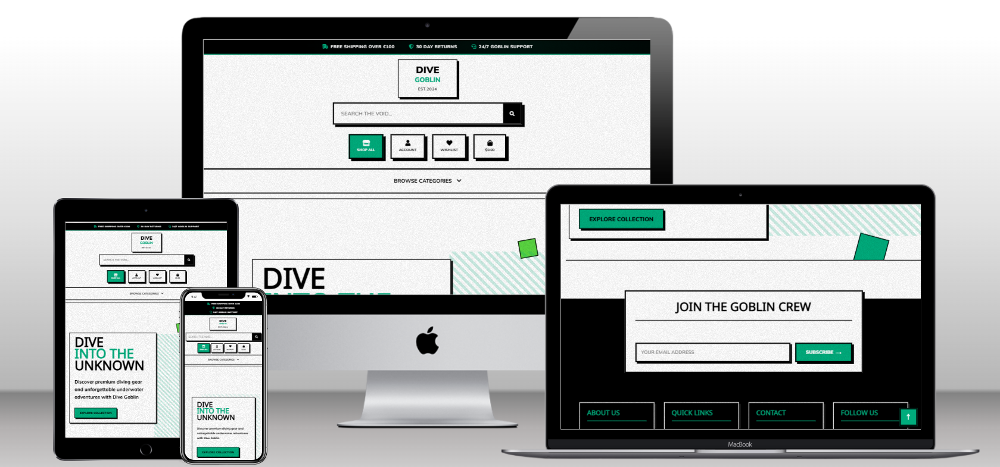

# Dive Goblin E-Commerce Platform



**Live Site**: [Dive Goblin](https://dive-goblin-30c473dd6e64.herokuapp.com/)  
**Repository**: [GitHub](https://github.com/kimatron/dive-goblin1)

---

## Overview

Dive Goblin is a full-stack e-commerce platform designed for diving enthusiasts and watersports lovers. Built with Django and featuring a bold brutalist design aesthetic, the platform offers a comprehensive shopping experience for diving gear, equipment, and apparel.

This project serves as my final milestone project for the Code Institute Full Stack Software Development course, demonstrating proficiency in full-stack development, e-commerce functionality, and modern web technologies.

---

## Table of Contents

1. [UX Design](#ux-design)
2. [User Stories](#user-stories)
3. [Features](#features)
4. [Database Design](#database-design)
5. [Technologies Used](#technologies-used)
6. [Testing](#testing)
7. [Deployment](#deployment)
8. [Marketing & SEO](#marketing--seo)
9. [Credits](#credits)
10. [Future Enhancements](#future-enhancements)

---

## UX Design

### Design Philosophy

The site embraces a brutalist design aesthetic - bold, geometric, and brutally digital. This design choice reflects the rugged, adventurous nature of diving while ensuring excellent functionality and accessibility. I wasn't sure if it was too harsh initially, but I ran with it and had a lot of fun styling the various elements and features along the way.

The site's visual language evolved through multiple iterations, starting with a more traditional e-commerce look before embracing the brutalist approach that better captured the brand's personality.

### Color Palette & Typography

**Color Strategy:**
- **Primary Black (`#000000`)**: Creates strong hierarchies and ensures text readability
- **Accent Green (`#00AC7C`)**: Evokes ocean depths while maintaining WCAG AA contrast ratios
- **Interaction Green (`#5ad641`)**: Provides clear feedback for user actions
- **Alert Yellow (`#FFE600`)**: High-visibility notifications
- **Pure White (`#FFFFFF`)**: Maximum contrast for critical information

**Typography:**
- **Primary: Space Mono** - Monospace font that reminded me of dive computer displays and professional equipment
- **Secondary: Noto Sans Manichaean** - Clean sans-serif for headings with international character support

### Wireframes

| Page | Desktop | Mobile |
|------|---------|--------|
| Home |  | Responsive design |
| Products |  | Grid adapts to mobile |
| Product Detail |  | Stacked layout |

### Responsive Design

The mobile-first approach wasn't just about screen sizes. Divers often browse gear on phones between dives, so the mobile experience needed to be exceptional. Core functionality works without JavaScript, with enhanced interactions layering on top for capable devices.

---

## User Stories

The development followed Agile methodologies with user stories driving feature development:

### Epic 1: User Authentication & Profiles
- **As a new user**, I want to easily register for an account so I can save my preferences and order history
- **As a returning user**, I want to quickly login to access my saved information  
- **As a user**, I want to manage my profile information including diving experience level

### Epic 2: Product Discovery & Shopping
- **As a shopper**, I want to browse products by category so I can find relevant gear
- **As a shopper**, I want to search for specific products to quickly find what I need
- **As a shopper**, I want to view detailed product information to make informed decisions
- **As a shopper**, I want to save products to a wishlist for future consideration

### Epic 3: Shopping Cart & Checkout
- **As a shopper**, I want to add products to my cart and adjust quantities
- **As a shopper**, I want a secure checkout process with clear pricing
- **As a shopper**, I want to receive order confirmation and tracking information

### Epic 4: Content & Community
- **As a visitor**, I want to learn about the company and their diving expertise
- **As a user**, I want to contact customer service with questions
- **As a user**, I want to stay updated with newsletter content

**Agile Implementation:**
- Features developed in 2-week sprints with clear deliverables
- GitHub Issues tracked all user stories with acceptance criteria
- Regular testing with actual divers influenced feature priorities

---

## Features

### Core E-commerce Functionality

#### 🛍️ Product Management
- **Product Catalog**: Organized by categories (Scuba, Snorkeling, Apparel, etc.)
- **Advanced Search**: Filter by name, description, and category
- **Product Details**: High-quality images, detailed descriptions, pricing
- **Inventory Tracking**: Stock levels and availability status
- **Admin CRUD**: Full product management through admin interface


#### 🛒 Shopping Experience
- **Shopping Cart**: Add, remove, and update product quantities
- **Wishlist**: Save products for future purchase
- **Quantity Controls**: Intuitive +/- buttons with validation
- **Price Calculation**: Real-time totals with delivery costs
- **Free Delivery Threshold**: €100 minimum for free shipping


#### 💳 Secure Checkout
- **Stripe Integration**: PCI-compliant payment processing
- **Order Management**: Complete order tracking and history
- **Email Confirmations**: Automated order confirmations
- **Delivery Information**: Comprehensive address collection
- **Guest Checkout**: Optional account creation


### User Account Features

#### 👤 Profile Management
- **Personal Information**: Name, email, diving experience level
- **Delivery Addresses**: Save default shipping information
- **Order History**: View past purchases and order status
- **Account Security**: Password management and account deletion


#### 🔐 Authentication
- **Django Allauth Integration**: Secure user authentication
- **Password Reset**: Email-based password recovery
- **Social Login**: Ready for social media authentication
- **Session Management**: Secure session handling


### Content Management

#### 📧 Newsletter System
- **Email Collection**: Newsletter signup with validation
- **Toast Notifications**: Success/error feedback
- **Unsubscribe Options**: GDPR-compliant email management
- **Admin Interface**: Newsletter creation and management


#### 📄 Information Pages
- **About Us**: Company story and team information
- **FAQ**: Comprehensive diving and shopping questions
- **Contact Form**: Customer service contact with validation
- **Privacy Policy**: GDPR-compliant privacy information
- **Terms of Service**: Legal terms and conditions


### Technical Features

#### 🎨 Responsive Design
- **Mobile-First**: Optimized for all device sizes
- **Progressive Enhancement**: Works without JavaScript
- **Touch-Friendly**: Large buttons and touch targets
- **Fast Loading**: Optimized images and efficient CSS

#### ♿ Accessibility
- **WCAG 2.1 AA**: Meets accessibility standards
- **Keyboard Navigation**: Full keyboard support
- **Screen Reader Friendly**: Proper ARIA labels and semantic HTML
- **High Contrast**: Accessible color combinations

#### 🔍 SEO Optimization
- **Meta Tags**: Comprehensive meta descriptions and keywords
- **Structured Data**: Schema markup for products
- **Sitemap**: XML sitemap for search engines
- **Robots.txt**: Search engine crawling guidelines

---

## Database Design

### Entity Relationship Diagram

The database follows Django best practices with normalized relationships:

### Core Entities

| Entity | Description | Key Fields |
|--------|-------------|------------|
| **User** | Django built-in authentication | id, username, email, password |
| **UserProfile** | Extended user information | user_id (FK), diving_level, bio, default_address |
| **Product** | Diving equipment catalog | id, name, price, stock, category_id (FK) |
| **Category** | Product organization | id, name, friendly_name |
| **Order** | Customer purchases | id, order_number, user_profile_id (FK), totals |
| **OrderLineItem** | Products within orders | order_id (FK), product_id (FK), quantity |
| **Wishlist** | Saved products | user_id (FK), products (M2M) |
| **NewsletterSubscriber** | Email marketing | email (unique), is_active |

### Relationships

| Relationship | Type | Description |
|--------------|------|-------------|
| User ↔ UserProfile | One-to-One | Each user has one profile |
| User ↔ Wishlist | One-to-One | Each user has one wishlist |
| User ↔ Order | One-to-Many | Users can have multiple orders |
| Category ↔ Product | One-to-Many | Products belong to one category |
| Wishlist ↔ Product | Many-to-Many | Products can be in multiple wishlists |
| Order ↔ Product | Many-to-Many | Via OrderLineItem intermediate table |

### Key Features
- **User Management**: Authentication + diving-specific profiles
- **Product Catalog**: Organized by categories with inventory tracking
- **Shopping**: Wishlist and order management with Stripe integration
- **Marketing**: Independent newsletter subscription system

---

## Models & Data Structure

### Core Application Models

The application uses Django's ORM with custom models designed specifically for diving e-commerce needs:

#### Product Management Models

**Product Model**
```python
class Product(models.Model):
    sku = models.CharField(max_length=255, blank=True, null=True)
    name = models.CharField(max_length=200)
    description = models.TextField()
    has_sizes = models.BooleanField(default=False, null=True, blank=True)
    price = models.DecimalField(max_digits=10, decimal_places=2)
    stock = models.PositiveIntegerField()
    category = models.ForeignKey('Category', on_delete=models.CASCADE)
    image = models.ImageField(upload_to='products/', blank=True, null=True)
    rating = models.DecimalField(max_digits=3, decimal_places=1, default=0)
    updated_at = models.DateTimeField(auto_now=True)

    def __str__(self):
        return self.name
```

**Category Model**
```python
class Category(models.Model):
    class Meta:
        verbose_name_plural = 'categories'
    
    name = models.CharField(max_length=250)
    friendly_name = models.CharField(max_length=254, null=True, blank=True)
    description = models.TextField(null=True, blank=True)

    def __str__(self):
        return self.name

    def get_friendly_name(self):
        return self.friendly_name
```

#### User Profile & Social Models

**UserProfile Model**
```python
class UserProfile(models.Model):
    GENDER_CHOICES = [
        ('', 'Prefer not to say'),
        ('M', 'Male'),
        ('F', 'Female'),
        ('O', 'Other'),
    ]

    DIVING_LEVEL_CHOICES = [
        ('beginner', 'Beginner'),
        ('intermediate', 'Intermediate'),
        ('advanced', 'Advanced'),
        ('professional', 'Professional'),
    ]

    user = models.OneToOneField(User, on_delete=models.CASCADE)
    gender = models.CharField(max_length=1, choices=GENDER_CHOICES, blank=True)
    date_of_birth = models.DateField(null=True, blank=True)
    diving_level = models.CharField(max_length=20, choices=DIVING_LEVEL_CHOICES, blank=True)
    bio = models.TextField(blank=True, null=True)
    
    # Default delivery information
    default_phone_number = models.CharField(max_length=20, null=True, blank=True)
    default_street_address1 = models.CharField(max_length=80, null=True, blank=True)
    default_street_address2 = models.CharField(max_length=80, null=True, blank=True)
    default_town_or_city = models.CharField(max_length=40, null=True, blank=True)
    default_county = models.CharField(max_length=80, null=True, blank=True)
    default_postcode = models.CharField(max_length=20, null=True, blank=True)
    default_country = CountryField(blank_label='Country', null=True, blank=True)

    def __str__(self):
        return self.user.username
```

**Wishlist Model**
```python
class Wishlist(models.Model):
    user = models.ForeignKey(User, on_delete=models.CASCADE)
    products = models.ManyToManyField(Product)

    def __str__(self):
        return f'Wishlist of {self.user.username}'
```

#### E-commerce Transaction Models

**Order Model**
```python
class Order(models.Model):
    order_number = models.CharField(max_length=32, null=False, editable=False)
    user_profile = models.ForeignKey(UserProfile, on_delete=models.SET_NULL,
                                   null=True, blank=True, related_name='orders')
    full_name = models.CharField(max_length=50, null=False, blank=False)
    email = models.EmailField(max_length=254, null=False, blank=False)
    phone_number = models.CharField(max_length=20, null=False, blank=False)
    country = CountryField(blank_label='Country *', null=False, blank=False)
    postcode = models.CharField(max_length=20, null=True, blank=True)
    town_or_city = models.CharField(max_length=40, null=False, blank=False)
    street_address1 = models.CharField(max_length=80, null=False, blank=False)
    street_address2 = models.CharField(max_length=80, null=True, blank=True)
    county = models.CharField(max_length=80, null=True, blank=True)
    date = models.DateTimeField(auto_now_add=True)
    delivery_cost = models.DecimalField(max_digits=6, decimal_places=2, null=False, default=0)
    order_total = models.DecimalField(max_digits=10, decimal_places=2, null=False, default=0)
    grand_total = models.DecimalField(max_digits=10, decimal_places=2, null=False, default=0)
    original_bag = models.TextField(null=False, blank=False, default='')
    stripe_pid = models.CharField(max_length=254, null=False, blank=False, default='')

    def _generate_order_number(self):
        """Generate a random, unique order number using UUID"""
        return uuid.uuid4().hex.upper()

    def save(self, *args, **kwargs):
        """Override the original save method to set the order number"""
        if not self.order_number:
            self.order_number = self._generate_order_number()
        super().save(*args, **kwargs)

    def update_total(self):
        """Update grand total each time a line item is added"""
        self.order_total = self.lineitems.aggregate(Sum('lineitem_total'))['lineitem_total__sum'] or 0
        if self.order_total < settings.FREE_DELIVERY_THRESHOLD:
            self.delivery_cost = self.order_total * settings.STANDARD_DELIVERY_PERCENTAGE / 100
        else:
            self.delivery_cost = 0
        self.grand_total = self.order_total + self.delivery_cost
        self.save()

    def __str__(self):
        return self.order_number
```

**OrderLineItem Model**
```python
class OrderLineItem(models.Model):
    order = models.ForeignKey(Order, null=False, blank=False, 
                            on_delete=models.CASCADE, related_name='lineitems')
    product = models.ForeignKey(Product, null=False, blank=False, on_delete=models.CASCADE)
    quantity = models.IntegerField(null=False, blank=False, default=0)
    lineitem_total = models.DecimalField(max_digits=6, decimal_places=2, 
                                       null=False, blank=False, editable=False)

    def save(self, *args, **kwargs):
        """Override the original save method to set the lineitem total"""
        self.lineitem_total = self.product.price * self.quantity
        super().save(*args, **kwargs)

    def __str__(self):
        return f'SKU {self.product.sku} on order {self.order.order_number}'
```

#### Marketing & Communication Models

**NewsletterSubscriber Model**
```python
class NewsletterSubscriber(models.Model):
    email = models.EmailField(unique=True)
    date_subscribed = models.DateTimeField(default=timezone.now)
    is_active = models.BooleanField(default=True)
    unsubscribe_token = models.UUIDField(default=uuid.uuid4, editable=False)
    
    def __str__(self):
        return self.email
    
    class Meta:
        ordering = ['-date_subscribed']
```

**Newsletter Model**
```python
class Newsletter(models.Model):
    subject = models.CharField(max_length=200)
    content = models.TextField()
    created_at = models.DateTimeField(default=timezone.now)
    sent_at = models.DateTimeField(null=True, blank=True)
    
    def __str__(self):
        return self.subject
    
    def send_newsletter(self):
        """Send this newsletter to all active subscribers"""
        if self.sent_at:
            raise ValueError("This newsletter has already been sent")
        
        subscribers = NewsletterSubscriber.objects.filter(is_active=True)
        sent_count = 0
        
        for subscriber in subscribers:
            try:
                unsubscribe_url = f"{settings.BASE_URL}/newsletter/unsubscribe/{subscriber.unsubscribe_token}/"
                html_content = render_to_string('newsletter/email_template.html', {
                    'subject': self.subject,
                    'content': self.content,
                    'unsubscribe_url': unsubscribe_url
                })
                
                send_mail(
                    subject=self.subject,
                    message="Please view this email with an HTML-compatible email client",
                    from_email=settings.DEFAULT_FROM_EMAIL,
                    recipient_list=[subscriber.email],
                    html_message=html_content,
                    fail_silently=False,
                )
                sent_count += 1
            except Exception as e:
                print(f"Error sending to {subscriber.email}: {e}")
                continue
        
        self.sent_at = timezone.now()
        self.save()
        return sent_count
```

### Model Relationships Summary

| Model | Primary Relationships | Business Logic |
|-------|---------------------|----------------|
| **Product** | `Category` (ForeignKey) | Core inventory with stock tracking |
| **UserProfile** | `User` (OneToOne) | Extended user data with diving-specific fields |
| **Wishlist** | `User` (ForeignKey), `Product` (ManyToMany) | User's saved products for future purchase |
| **Order** | `UserProfile` (ForeignKey) | Complete order with delivery & payment info |
| **OrderLineItem** | `Order` & `Product` (ForeignKey) | Individual products within an order |
| **Newsletter** | Standalone | Marketing campaigns with tracking |

### Key Model Features

#### Automatic Calculations
- **Order totals** update automatically via Django signals
- **Delivery costs** calculated based on configurable thresholds
- **Stock levels** tracked and validated during checkout

#### Security & Data Integrity
- **UUID-based order numbers** for security
- **Soft deletes** preserve order history
- **Unique constraints** prevent duplicate newsletter subscriptions
- **Foreign key cascades** maintain referential integrity

#### Extensibility
- **Choice fields** for diving levels and user preferences
- **JSON fields** ready for complex product variations
- **Timestamp tracking** for audit trails
- **Flexible address system** supporting international customers

---

## Technologies Used

### Backend Technologies

- **Django 5.1.3**: Web framework providing robust MVC architecture and built-in security
- **Python 3.12**: Core programming language
- **PostgreSQL**: Production database (SQLite for development)
- **Django Allauth**: Authentication and account management
- **Stripe API**: Secure payment processing
- **Django Countries**: International address support

**Key Django Benefits:**
- Built-in security features (CSRF protection, SQL injection prevention)
- Powerful ORM for complex product filtering and order management
- Admin interface for rapid content management
- Scalable MVT architecture for future expansion

### Frontend Technologies

- **HTML5**: Semantic markup structure
- **CSS3**: Custom styling with CSS Grid and Flexbox
- **JavaScript (ES6+)**: Interactive functionality with progressive enhancement
- **Bootstrap 5**: Responsive framework components
- **Font Awesome**: Icon library

**CSS Architecture Decision:**
While Bootstrap handles the responsive grid, custom CSS achieves the brutalist aesthetic. This approach provides unique brand expression while maintaining performance.

### Infrastructure & Deployment

- **Heroku**: Cloud application platform with git-based deployment
- **AWS S3**: Media and static file storage with CDN-like delivery
- **Gunicorn**: WSGI HTTP server
- **WhiteNoise**: Static file serving
- **Git & GitHub**: Version control and project management

**Why Heroku?**
Chosen for rapid deployment workflow, managed services, and cost-effective pay-as-you-scale model perfect for project demonstration.

### Payment & Security

**Stripe Integration:**
```python
# Secure payment processing with webhook handling
@csrf_exempt
def stripe_webhook(request):
    payload = request.body
    sig_header = request.META.get('HTTP_STRIPE_SIGNATURE')
    
    try:
        event = stripe.Webhook.construct_event(
            payload, sig_header, endpoint_secret
        )
        if event['type'] == 'payment_intent.succeeded':
            handle_payment_success(event['data']['object'])
    except ValueError:
        return HttpResponse(status=400)
```

**Benefits:**
- PCI compliance handled by Stripe
- International payment support  
- Robust webhook system for reliable order processing
- Excellent developer documentation and testing tools

### Database Optimization

**PostgreSQL with Django ORM:**
```python
# Efficient product filtering with select_related
def filtered_products(request):
    products = Product.objects.select_related('category')
    
    if search_query:
        products = products.filter(
            Q(name__icontains=query) | Q(description__icontains=query)
        )
    return products.order_by(sort_field)
```

**Design Principles:**
- Normalized structure prevents data redundancy
- Soft deletes maintain order history
- Extensible profile model for diving-specific fields
- Strategic indexing on frequently queried fields

### Development Tools

- **VS Code / Gitpod**: IDEs (switched to Gitpod when VS Code mysteriously broke!)
- **Chrome DevTools**: Testing and debugging
- **Lighthouse**: Performance and accessibility auditing
- **GitHub Issues**: Agile project management

---

## Security Features

### Data Protection
- **CSRF Protection**: Django's built-in CSRF middleware
- **SQL Injection Prevention**: Django ORM parameterized queries
- **XSS Protection**: Template auto-escaping
- **Secure Sessions**: HTTPOnly and Secure cookie flags

### Payment Security
- **PCI Compliance**: Stripe handles all card data
- **Webhook Verification**: Signed webhook validation
- **Environment Variables**: Sensitive data stored securely

### User Authentication
- **Password Hashing**: Django's PBKDF2 algorithm
- **Session Management**: Secure session handling
- **Password Reset**: Token-based password recovery

---

## Error Handling

### Custom Error Pages
- **404 Page**: Custom "dive deeper" themed error page
- **500 Page**: Server error with contact information
- **403 Page**: Permission denied with helpful navigation


### Form Validation
- **Client-side**: JavaScript validation for immediate feedback
- **Server-side**: Django form validation for security
- **Payment Errors**: Stripe error handling with user-friendly messages

---
## Testing

Comprehensive testing has been conducted across all aspects of the application. For detailed testing documentation, including manual testing procedures, automated test results, accessibility audits, and cross-browser compatibility reports, please refer to:

**📋 [Complete Testing Documentation: TESTING.md](TESTING.md)**

The testing strategy encompasses:
- Manual testing of all user journeys
- Cross-browser compatibility validation
- Responsive design testing across devices
- Performance optimization and Lighthouse audits
- Accessibility compliance (WCAG 2.1 AA)
- Security testing including payment processing

---

## Deployment

### Production Environment Architecture

The application is deployed using a modern cloud infrastructure approach that ensures scalability, security, and reliability:

```
Internet → Cloudflare (CDN) → Heroku Router → Django Application
                                            ↓
                                       PostgreSQL Database
                                            ↓
                                       AWS S3 (Static/Media)
                                            ↓
                                       Stripe API (Payments)
                                            ↓
                                       Email Services (Gmail SMTP)
```

### Prerequisites for Deployment

Before beginning deployment, ensure you have accounts and access to:

**Required Services:**
- [Heroku](https://heroku.com) account with billing enabled
- [AWS](https://aws.amazon.com) account for S3 storage
- [Stripe](https://stripe.com) account for payment processing
- Gmail account with App Password enabled for email services

**Local Development Requirements:**
- Python 3.12 or higher
- Git version control
- Code editor (VS Code, PyCharm, etc.)

---

### Local Development Setup

#### 1. Repository Setup and Environment

```bash
# Clone the repository
git clone https://github.com/kimatron/dive-goblin1.git
cd dive-goblin1

# Create and activate virtual environment
python -m venv venv

# Activate virtual environment
# Windows:
venv\Scripts\activate
# macOS/Linux:
source venv/bin/activate

# Upgrade pip to latest version
python -m pip install --upgrade pip

# Install project dependencies
pip install -r requirements.txt
```

#### 2. Environment Variables Configuration

Create a `.env` file in the project root directory:

```bash
# Create .env file
touch .env  # macOS/Linux
# OR create manually on Windows
```

**Development Environment Variables (.env):**
```env
# Django Core Settings
SECRET_KEY=your-super-secret-django-key-here-generate-new-one
DEBUG=True
DATABASE_URL=sqlite:///db.sqlite3

# Email Configuration (Development - Console Backend)
EMAIL_BACKEND=django.core.mail.backends.console.EmailBackend
DEFAULT_FROM_EMAIL=admin@divegoblin.local

# Stripe Configuration (Use TEST keys only)
STRIPE_PUBLIC_KEY=pk_test_your_stripe_public_key_here
STRIPE_SECRET_KEY=sk_test_your_stripe_secret_key_here
STRIPE_WH_SECRET=whsec_your_webhook_secret_here

# Development Settings
USE_AWS=False
DEVELOPMENT=True

# Optional: AWS Configuration (for testing S3 locally)
# AWS_ACCESS_KEY_ID=your_aws_access_key
# AWS_SECRET_ACCESS_KEY=your_aws_secret_key
# AWS_STORAGE_BUCKET_NAME=your_bucket_name
# AWS_S3_REGION_NAME=eu-west-1
```

#### 3. Database Setup and Migration

```bash
# Apply database migrations
python manage.py migrate

# Create superuser account for admin access
python manage.py createsuperuser
# Follow prompts to create username, email, and password

# Load sample data (optional)
# If fixtures exist:
python manage.py loaddata fixtures/categories.json
python manage.py loaddata fixtures/products.json

# Collect static files
python manage.py collectstatic --noinput
```

#### 4. Development Server Launch

```bash
# Start the Django development server
python manage.py runserver

# Application will be available at:
# http://127.0.0.1:8000/
```

#### 5. Development Verification

**Test the following endpoints:**
- **Homepage**: `http://127.0.0.1:8000/`
- **Admin Panel**: `http://127.0.0.1:8000/admin/`
- **Products**: `http://127.0.0.1:8000/products/`
- **User Registration**: `http://127.0.0.1:8000/accounts/signup/`

**Run system checks:**
```bash
# Django system check
python manage.py check

# Check for potential issues
python manage.py check --deploy

# Run any existing tests
python manage.py test
```

---

### Stripe Development Setup

#### 1. Stripe Account Configuration

**Create Stripe Test Account:**
1. Sign up at [Stripe Dashboard](https://dashboard.stripe.com/register)
2. Navigate to "Developers" → "API keys"
3. Copy "Publishable key" and "Secret key" (ensure you're in TEST mode)

**Webhook Configuration:**
1. Go to "Developers" → "Webhooks"
2. Click "Add endpoint"
3. Use URL: `http://127.0.0.1:8000/checkout/wh/`
4. Select events: `payment_intent.succeeded`, `payment_intent.payment_failed`
5. Copy the webhook signing secret

#### 2. Test Card Numbers

**Stripe provides test card numbers for development:**
```
# Successful payments
4242424242424242 - Visa
4000002500003155 - Mastercard

# Failed payments
4000000000000002 - Generic decline
4000000000009995 - Insufficient funds

# All test cards use:
# Expiry: Any future date (e.g., 12/25)
# CVC: Any 3 digits (e.g., 123)
# ZIP: Any 5 digits (e.g., 12345)
```

---

### AWS S3 Setup for Media Storage

#### 1. S3 Bucket Creation

**Create S3 Bucket:**
1. Log into [AWS Console](https://console.aws.amazon.com/)
2. Navigate to S3 service
3. Click "Create bucket"
4. Choose unique bucket name (e.g., `dive-goblin-media-bucket`)
5. Select region (preferably same as your users)
6. **Important**: Uncheck "Block all public access"
7. Acknowledge public access warning
8. Create bucket

#### 2. Bucket Policy Configuration

**Set Bucket Policy:**
1. Go to bucket → "Permissions" → "Bucket policy"
2. Add the following policy (replace `YOUR_BUCKET_NAME`):

```json
{
    "Version": "2012-10-17",
    "Statement": [
        {
            "Sid": "PublicReadGetObject",
            "Effect": "Allow",
            "Principal": "*",
            "Action": "s3:GetObject",
            "Resource": "arn:aws:s3:::YOUR_BUCKET_NAME/*"
        }
    ]
}
```

#### 3. CORS Configuration

**Set CORS policy:**
1. Go to "Permissions" → "Cross-origin resource sharing (CORS)"
2. Add the following configuration:

```json
[
    {
        "AllowedHeaders": [
            "*"
        ],
        "AllowedMethods": [
            "GET",
            "HEAD",
            "PUT",
            "POST",
            "DELETE"
        ],
        "AllowedOrigins": [
            "*"
        ],
        "ExposeHeaders": []
    }
]
```

#### 4. IAM User Creation

**Create IAM User for S3 Access:**
1. Navigate to IAM service
2. Click "Users" → "Add user"
3. Username: `dive-goblin-s3-user`
4. Access type: "Programmatic access"
5. Attach existing policies: `AmazonS3FullAccess`
6. Create user and **save the Access Key ID and Secret Access Key**

---

### Heroku Production Deployment

#### 1. Heroku Application Setup

```bash
# Install Heroku CLI if not already installed
# Visit: https://devcenter.heroku.com/articles/heroku-cli

# Login to Heroku
heroku login

# Create new Heroku application
heroku create your-unique-app-name

# Add PostgreSQL database addon
heroku addons:create heroku-postgresql:mini

# Verify database creation
heroku config:get DATABASE_URL
```

#### 2. Production Environment Variables

**Set all production environment variables in Heroku:**

```bash
# Django Core Settings
heroku config:set SECRET_KEY=your-production-secret-key-different-from-dev
heroku config:set DEBUG=False
heroku config:set DATABASE_URL=postgresql://... # (automatically set by Heroku)

# Allowed Hosts
heroku config:set ALLOWED_HOSTS=your-app-name.herokuapp.com

# Stripe Configuration (LIVE keys for production)
heroku config:set STRIPE_PUBLIC_KEY=pk_live_your_live_public_key
heroku config:set STRIPE_SECRET_KEY=sk_live_your_live_secret_key
heroku config:set STRIPE_WH_SECRET=whsec_your_live_webhook_secret

# AWS S3 Configuration
heroku config:set USE_AWS=True
heroku config:set AWS_ACCESS_KEY_ID=your_aws_access_key_id
heroku config:set AWS_SECRET_ACCESS_KEY=your_aws_secret_access_key
heroku config:set AWS_STORAGE_BUCKET_NAME=your_s3_bucket_name
heroku config:set AWS_S3_REGION_NAME=eu-west-1
heroku config:set AWS_S3_CUSTOM_DOMAIN=your_s3_bucket_name.s3.amazonaws.com

# Email Configuration (Production)
heroku config:set EMAIL_BACKEND=django.core.mail.backends.smtp.EmailBackend
heroku config:set EMAIL_HOST=smtp.gmail.com
heroku config:set EMAIL_PORT=587
heroku config:set EMAIL_USE_TLS=True
heroku config:set EMAIL_HOST_USER=your_gmail_address@gmail.com
heroku config:set EMAIL_HOST_PASSWORD=your_gmail_app_password
heroku config:set DEFAULT_FROM_EMAIL=your_gmail_address@gmail.com

# Additional Production Settings
heroku config:set DEVELOPMENT=False
heroku config:set DISABLE_COLLECTSTATIC=1
```

#### 3. Deploy to Heroku

```bash
# Add Heroku remote
git remote add heroku https://git.heroku.com/your-app-name.git

# Deploy to Heroku
git push heroku main

# Run database migrations
heroku run python manage.py migrate

# Create superuser
heroku run python manage.py createsuperuser

# Collect static files
heroku run python manage.py collectstatic --noinput

# Open the deployed application
heroku open
```

#### 4. Heroku Configuration Files

**Ensure these files are in your repository root:**

**Procfile:**
```
web: gunicorn dive_goblin.wsgi:application
```

**runtime.txt:**
```
python-3.12.0
```

**requirements.txt** (ensure all dependencies are listed):
```
Django==5.1.3
gunicorn==23.0.0
dj-database-url==0.5.0
psycopg2==2.9.9
django-allauth==0.63.3
stripe==9.4.0
boto3==1.35.1
django-storages==1.14.4
whitenoise==6.6.0
pillow==10.4.0
django-crispy-forms==1.14.0
django-countries==7.6.1
# ... other dependencies
```

---

### Email Configuration

#### Gmail SMTP Setup

**Enable Gmail App Passwords:**
1. Go to [Google Account Settings](https://myaccount.google.com/)
2. Security → 2-Step Verification (enable if not already)
3. App passwords → Generate new app password
4. Use this password in your environment variables

**Environment Variables for Email:**
```bash
# Production email settings
EMAIL_BACKEND=django.core.mail.backends.smtp.EmailBackend
EMAIL_HOST=smtp.gmail.com
EMAIL_PORT=587
EMAIL_USE_TLS=True
EMAIL_HOST_USER=your_email@gmail.com
EMAIL_HOST_PASSWORD=your_app_password  # NOT your regular password
DEFAULT_FROM_EMAIL=your_email@gmail.com
```

---

### Stripe Webhook Configuration for Production

#### 1. Production Webhook Setup

**Create Production Webhook:**
1. Go to [Stripe Dashboard](https://dashboard.stripe.com/) (LIVE mode)
2. Developers → Webhooks → Add endpoint
3. Endpoint URL: `https://your-app-name.herokuapp.com/checkout/wh/`
4. Select events:
   - `payment_intent.succeeded`
   - `payment_intent.payment_failed`
5. Copy the webhook signing secret

#### 2. Test the Webhook

```bash
# Test webhook locally with Stripe CLI
stripe listen --forward-to localhost:8000/checkout/wh/

# Test with real payment in production
# Use Stripe test mode first, then switch to live mode
```

---

### Database Management

#### Production Database Operations

```bash
# Access production database
heroku pg:psql

# Create database backup
heroku pg:backups:capture

# Download backup
heroku pg:backups:download

# Import data to production (use carefully)
heroku run python manage.py loaddata fixture_name.json

# Reset database (DANGER: This will delete all data)
heroku pg:reset DATABASE_URL
heroku run python manage.py migrate
heroku run python manage.py createsuperuser
```

---

### Monitoring and Maintenance

#### Application Monitoring

```bash
# View application logs
heroku logs --tail

# Check application status
heroku ps

# Restart application
heroku restart

# Scale application (if needed)
heroku ps:scale web=1

# Check configuration variables
heroku config
```

#### Performance Monitoring

**Tools to monitor:**
- Heroku Metrics (in dashboard)
- Application Performance Monitoring (APM) tools
- Google Lighthouse audits
- User experience monitoring

#### Security Considerations

**Production Security Checklist:**
- ✅ DEBUG=False in production
- ✅ Unique SECRET_KEY for production
- ✅ HTTPS enforced (Heroku provides this)
- ✅ CSRF protection enabled
- ✅ SQL injection protection (Django ORM)
- ✅ XSS protection headers
- ✅ Secure session handling
- ✅ Regular dependency updates

---

### Troubleshooting Common Deployment Issues

#### Static Files Not Loading

```bash
# Ensure DISABLE_COLLECTSTATIC is not set to 1
heroku config:unset DISABLE_COLLECTSTATIC

# Force collect static files
heroku run python manage.py collectstatic --clear --noinput

# Check AWS S3 configuration
heroku config:get AWS_ACCESS_KEY_ID
heroku config:get AWS_STORAGE_BUCKET_NAME
```

#### Database Connection Issues

```bash
# Check database URL
heroku config:get DATABASE_URL

# Test database connection
heroku run python manage.py dbshell

# Run migrations if needed
heroku run python manage.py migrate
```

#### Stripe Payment Issues

```bash
# Verify Stripe configuration
heroku config:get STRIPE_PUBLIC_KEY
heroku config:get STRIPE_SECRET_KEY

# Check webhook endpoints in Stripe dashboard
# Ensure webhook URL is correct: https://your-app.herokuapp.com/checkout/wh/
```

#### Email Delivery Issues

```bash
# Test email configuration
heroku run python manage.py shell
>>> from django.core.mail import send_mail
>>> send_mail('Test', 'This is a test', 'from@example.com', ['to@example.com'])

# Check Gmail app password configuration
heroku config:get EMAIL_HOST_PASSWORD
```

---

### Performance Optimization

#### Production Optimizations

**Enable compression and caching:**
```python
# In settings.py for production
STATICFILES_STORAGE = 'storages.backends.s3boto3.StaticS3Boto3Storage'
DEFAULT_FILE_STORAGE = 'storages.backends.s3boto3.MediaS3Boto3Storage'

# Enable GZip compression
MIDDLEWARE = [
    'django.middleware.gzip.GZipMiddleware',
    # ... other middleware
]
```

**Database query optimization:**
- Use `select_related()` for foreign key relationships
- Use `prefetch_related()` for many-to-many relationships
- Add database indexes for frequently queried fields

**CDN Configuration:**
- AWS CloudFront for static file delivery
- Image optimization for product photos
- Lazy loading for images

---

This deployment guide provides comprehensive coverage of all aspects needed to successfully deploy Dive Goblin to production while maintaining security, performance, and reliability standards.

---

## Marketing & SEO

### Digital Marketing Strategy

#### Social Media Presence
- **Facebook Business Page**: [Dive Goblin Facebook](https://www.facebook.com/divegoblin)
- **Content Strategy**: Diving tips, product showcases, community features
- **Engagement**: User-generated content and diving experiences


#### Email Marketing
- **Newsletter System**: Automated welcome emails and product updates
- **Segmentation**: Diving experience level and purchase history
- **GDPR Compliance**: Clear opt-in/opt-out processes

#### SEO Implementation
- **Technical SEO**: Sitemap.xml, robots.txt, meta descriptions
- **Content SEO**: Diving-focused keywords and long-tail phrases
- **Local SEO**: Geographic targeting for diving locations

```xml
<!-- meta tags -->
<meta name="description" content="Dive Goblin - Premium diving equipment and scuba gear. Quality masks, fins, wetsuits and accessories for diving enthusiasts.">
<meta name="keywords" content="diving equipment, scuba gear, diving masks, wetsuits, diving accessories">
```

### Business Model

**B2C E-commerce Model** targeting:
- **Primary**: Recreational divers and snorkeling enthusiasts
- **Secondary**: Diving instructors and professionals
- **Geographic**: Initially Ireland/UK, expanding to EU/Worldwide

**Revenue Streams:**
- Product sales with 40-60% markup
- Premium shipping options
- Future: Diving course bookings and equipment rentals

---
## Fun bits and Quirks

I was playing around with different versions of Django backend, and found a cool feature in jazzmin that you can customize the theme and color scheme, and added my own icons.


## ⚙️ How to Implement Jazzmin Admin Theme

### 📦 Installation

1. Install the package:
```bash
pip install django-jazzmin
```
Then, add it to your INSTALLED_APPS above django.contrib.admin:

```
INSTALLED_APPS = [
    "jazzmin",  # must come before 'django.contrib.admin'
    "django.contrib.admin",
    ...
]
```
⚙️ Basic Configuration (Optional)
Add this to your settings.py to start customizing:

```
JAZZMIN_SETTINGS = {
    "site_title": "Dive Goblin Admin",
    "site_header": "Dive Goblin",
    "site_brand": "Dive Goblin",
    "theme": "darkly",  # Choose from themes like 'darkly', 'cosmo', 'flatly'
    "custom_icons": {
        "dive.LogEntry": "fas fa-fish",
        "auth.User": "fas fa-user-diving",
    },
}
```

🎨 For a full list of customization options, check the Jazzmin docs.

## Credits

### Code & Learning Resources
- **Code Institute**: Boutique Ado walkthrough provided the foundation, though Dive Goblin evolved far beyond the original scope
- **Django Documentation**: Essential for implementing advanced features and best practices
- **Stripe Documentation**: Critical for secure payment processing implementation
- **Mozilla MDN**: Web standards and accessibility guidelines

### Design Inspiration & Tools
- **Brutalist Web Design**: Aesthetic concepts and layout inspiration
- **UIverse**: Component styling inspiration, especially [Kirzin's buttons](https://uiverse.io/Kirzin)
- **CodePen**: Interactive effects, particularly [Nick Cipher's backgrounds](https://codepen.io/luisciphere/pen/WXXgWm)
- **Adobe Firefly**: Logo creation and brand elements

### Media & Content
- **Unsplash**: Product photography and lifestyle images
- **Aqualung & ScubaPro**: Product specifications and technical descriptions
- **Personal Photography**: Team photos and diving experiences
- **Techsini**: Responsive mockup generation

### Special Thanks & Development Journey

This project has been quite the adventure! Building a full-stack e-commerce platform turned out to be a lot like planning a deep-sea dive - you need the right equipment, careful preparation, and problem-solving skills when unexpected challenges arise.

**🤿 The Real MVPs:**
- **Viola**: My debugging partner who spent countless hours on huddles with me, preventing multiple laptop-throwing incidents and helping solve the most frustrating issues. Her patience during those "why isn't this working?!" moments was invaluable.
- **Code Institute Mentors**: For technical guidance and keeping me on track when I got lost in Django documentation
- **The Slack Community**: Fellow students who shared solutions and reminded me I wasn't alone in this journey
- **My Family**: For understanding why I disappeared into coding sessions for weeks

**🛠️ Development Reality Check:**
- **VS Code → Gitpod Migration**: When VS Code completely broke my development environment for mysterious reasons, Gitpod became my lifeline
- **CSS Organization Crisis**: When my CSS file became a 1000+ line monster, using Merlin to restructure it saved my sanity
- **AWS S3 Storage Battle**: Learning that Django 5.1 broke my storage configuration taught me the importance of staying current with framework changes

The brutalist design wasn't just aesthetic - it reflects the bold, no-nonsense attitude of the diving community. Like good diving equipment, the interface needed to be crystal clear, reliable, and built to handle pressure!

---

## Future Enhancements

### Planned Features (Next Iteration)
- **Product Reviews**: User ratings and written feedback
- **Advanced Filtering**: Price ranges, brand filters, availability
- **Diving Course Bookings**: Integration with training providers
- **Equipment Rental**: Short-term gear rental system
- **Community Features**: Diving log sharing and trip planning

### Technical Improvements
- **Performance**: Image optimization and caching strategies
- **Accessibility**: Enhanced screen reader support
- **Mobile App**: React Native companion application
- **Inventory Integration**: Real-time stock management
- **Analytics**: Advanced user behavior tracking

### Business Expansion
- **International Shipping**: Expanded geographic coverage
- **Multi-Currency**: Regional pricing and currency support
- **B2B Portal**: Wholesale accounts for dive shops
- **Subscription Service**: Regular gear maintenance packages

---

## Fin

Dive Goblin represents a comprehensive full-stack e-commerce solution that successfully combines modern web technologies with a unique design aesthetic. The project demonstrates proficiency in backend development, frontend design, e-commerce functionality, cloud deployment, and professional development practices.

Through careful planning, iterative development, and comprehensive testing, Dive Goblin delivers both functionality and user experience that meets professional standards while showcasing the technical skills required for modern web development.

---

**Repository**: [https://github.com/kimatron/dive-goblin1](https://github.com/kimatron/dive-goblin1)  
**Live Demo**: [https://dive-goblin-30c473dd6e64.herokuapp.com/](https://dive-goblin-30c473dd6e64.herokuapp.com/)

*Developed by Kim Hanlon as final milestone project for Code Institute Full Stack Software Development Course (2024)*